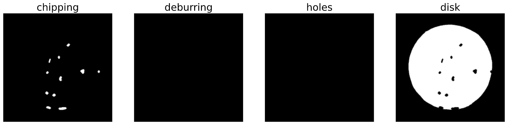

# **Mask R-CNN training with docker containers on Sagemaker**

Mask R-CNN for metal casting defects detection and instance segmentation using Keras and TensorFlow.

# **Overview**

The core of the project was the matterport implementation of [Mask R-CNN](https://arxiv.org/pdf/1703.06870.pdf) an architecture proposed by Ross Girshick et al., revisited using [Feature pyramid network](https://arxiv.org/pdf/1612.03144.pdf) as final stage and using [Resnet101](https://arxiv.org/pdf/1512.03385.pdf) as backbone.

In this project our target was to train the Mask_RCNN matterport implementation on our dataset using the sagemaker service of AWS. Our work in this way was principaly to prepare the dataset, the functions that adapt the dataset annotation with supervisely structure to the the input format of the framework, and the script that allow to lunch the training process on a docker container, with the specific needs of sagemaker. 
Below is shown how to use sagemaker and how to prepare your image for training on a docker container using SageMaker.

Here is shown the result model inferencing on an image external to the training set and validation set.


- - -

# **Index**

<!-- START doctoc generated TOC please keep comment here to allow auto update -->
<!-- DON'T EDIT THIS SECTION, INSTEAD RE-RUN doctoc TO UPDATE -->
<!-- param::isNotitle::true:: -->

- [**Project struscture**](#project-struscture)
- [**Dataset**](#dataset)
  - [**Original dataset**](#original-dataset)
  - [**Our dataset**](#our-dataset)
    - [**Mask images preparation**](#mask-images-preparation)
    - [**Json annotations preparation**](#json-annotations-preparation)
    - [**Augmentation**](#augmentation)
- [**Training on Sagemaker**](#training-on-sagemaker)
  - [**Sagemaker overview**](#sagemaker-overview)
  - [**Sagemaker API**](#sagemaker-api)
  - [**Taraining job on SageMaker**](#taraining-job-on-sagemaker)
    - [**Sagemaker container folder structure**](#sagemaker-container-folder-structure)
    - [**S3 as training data source and results destination**](#s3-as-training-data-source-and-results-destination)
    - [**Push the Docker image to ECR**](#push-the-docker-image-to-ecr)
    - [**Start the training job**](#start-the-training-job)
    - [**Output and tensorboard data**](#output-and-tensorboard-data)
  - [**Hyperparameters and environment variabes**](#hyperparameters-and-environment-variabes)
    - [**hyperparameters**](#hyperparameters)
    - [**Environment**](#environment)
  - [**Estimator parameters explained**](#estimator-parameters-explained)
    - [**The fit method**](#the-fit-method)
- [**Results**](#results)
- [**Useful links**](#useful-links)
  - [AWS docs](#aws-docs)
  - [Sagemaker docs](#sagemaker-docs)
  - [Dataset](#dataset-1)
  - [Docker](#docker)
  - [Git reference](#git-reference)
  - [Useful articles](#useful-articles)
  - [Jupyter docs](#jupyter-docs)
  - [Related papers](#related-papers)

<!-- END doctoc generated TOC please keep comment here to allow auto update -->
- - -

# **Project struscture**

In this section is shown the structure of the project and what is the content of each folder, below there is a little description of each one.

```text
.
├── assets
├── Augmentation_notebooks
├── cudnn-10.0-linux-x64-v7.6.3.30
├── dataset_preparation_notebooks
│   ├── obj_class_to_machine_color.json
│   ├── sample_annotations
│   ├── sample_imgs
│   ├── sample_masks
│   ├── supervisely_json_dataset_preparation.ipynb
│   └── supervisely_mask_dataset_preparetion.ipynb
├── datasets
├── Mask_RCNN
│   ├── cast_debug.py
│   ├── cast_inference.py
│   ├── cast_sagemaker.py
│   ├── lesions.py
│   ├── lesions_sagemaker.py
│   ├── LICENSE
│   └── mrcnn
├── Model
|   └── mask_rcnn_coco.h5
├── Sagemaker_cast_example
│   ├── cast_container_training.ipynb
│   └── Docker_image_tf_aws
│       ├── build.sh
│       ├── docker-compose.yml
│       └── Dockerfile
├── Sagemaker_dummy_example
├── Sagemaker_lesion_example
└── tools

```

- **assets:** folder that contain readme images.

- **Augmentation_notebooks:** collection of notebooks for imgaug functions testing, with notebooks diveded by type.

- **cudnn-10.0-linux-x64-v7.6.3.30:** Folder in witch you should put cudnn files following the readme inside, this is used during the docker images builds.  

- **dataset_preparation_notebooks:** In this folder there are same image of the dataset with annotations, and there are two notebooks with explained two way to import the dataset, and prepare it for maskrcnn.

- **datasets:** In thi folder are presents same dataset that we use for test, one of is the main dataset the only dataset physically present.

- **Mask_RCNN:** This is the main folder of the project containing all the scripts for various purpose from inference on the model, to dataset importation debug and inference. In the same folder is contained the framework, in the folder <ins>maskrcnn</ins>, note that we have applaied same modification to it.

  - [cast_debug.py](Mask_RCNN/cast_debug.py): Script used for augmentation and masks loading debug
  - [cast_inference.py](Mask_RCNN/cast_inference.py): Script used for visualize the inference
  - [cast_sagemaker.py](Mask_RCNN/cast_sagemaker.py): Script used for launch the training on the cast dataset on the Sagemaker.
  - [lesions.py](Mask_RCNN/lesions.py): Script used for launch the training on ISIC2018 dataset in local
  - [lesions_sagemaker.py](Mask_RCNN/lesions_sagemaker.py): Script used for launch the training on ISIC2018 dataset on sagemaker.
  - [mrcnn](Mask_RCNN/mrcnn): Folder containing the mask_rcnn framework.

- **Model:** In this folder is contained a pretrained model of Maskrcnn on COCO.

- **Sagemaker_cast_example:** This folder contain the example of training of our dataset on sagemaker, there is a docker file for build it, a script for build it and push it to you aws ecr repository.
In the same folder there is a docker-compose file whit volumes bindings, to test the correct behaviour of the container in local on your machine.

- **Sagemaker_dummy_example:** First example with a sample program to test the behaviour of sagemaker, without any training only fake logs.

- **Sagemaker_dummy_example_2:** Another example.

- **Sagemaker_lesion_example:** Example of training on sagemaker with ISIC2018 dataset.

- **tools:** Folder containg same usefull script for training data syncronization and data preparation.

- - -

# **Dataset**

## **Original dataset**

The original dataset is an image collection of one type of casted metal product done with similar angle of view and with the objects every in front view.
The dataset was divided only by defected and not defected object, in fact it is a dataset for only image classification.
It's composed by 781 objects with defects and 519 object without defects, the same images are available in two resolution 512x512 and 300x300.
the dataset it's available on kaggle at this [link](https://www.kaggle.com/ravirajsinh45/real-life-industrial-dataset-of-casting-product)


## **Our dataset**

Our dataset start from the precedent mentioned image classification dataset, in which we have added masks for the segmentation task. The dataset was done using [Supervisely](https://app.supervise.ly/) a powerfull tool for create your own 3D 2D datasets, for object detection, semantic and instance segmentation.
The original dataset was made by 1300 images, due to time constraints we have only annotated 238 images. In our dataset structure are present 4 classes [disk, hole, chipping, deburring], the first is present in every image of the dataset, the other three classes are preset only in images with defected disks.


(this image is only rappresentative then how classes are applied)

The dataset is released in [**supervisely format**](https://docs.supervise.ly/data-organization/00_ann_format_navi/04_supervisely_format_objects), where there is two way to extract objects bitmaps shown below.
The goal for the dataset preparation for training Mask R-CNN is to extract from the dataset for each image several masks, one for each istance of object that is present into this immage and that is labled. Each mask is a simple numpy array of bool or uint8 with shape `(height, width)`, where the background is indicated with zero and the labeed region of our istance is marked with pixel of value 1.
At the end of the process we need to obtain for each image a numpy array with shape `(height, width, n_inst)` where `n_inst` is the number of instace of every class in the image and an array with shape `(n_inst)` that contains the class of each instance into the 3D array of masks.

### **Mask images preparation**

Notebook with code example: [**supervisely_mask_dataset_preparetion.ipynb**](dataset_preparation_notebooks/supervisely_mask_dataset_preparetion.ipynb)

The first way is to use the images into `datasets/cast_dataset/masks_machine/` folder where each image have the same name of the original, but their color are mapped in different way, in this format each pixel represent a class, the associations between colors and classes can be found into the `obj_class_to_machine_color.json` file, presented below in json format.

```json
{
  "chipping":   [1, 1, 1],
  "deburring":  [2, 2, 2],
  "holes":      [3, 3, 3],
  "disk":       [4, 4, 4]
}
```

The image in this format isn't visible to human eye as can be seen below, but it is easy to manipulate with a simple script.
In this images it's shown as the istances appear completely black but if the small differences in the pixels are highlighted they beacame visibles.


All we need for start the process of instance separation is to extract from the mask, each pixel with the same value and place it in another blank image by changing the values of the class pixel to 255, The result will be n matrix for n class.
In this case in the original mask were only instances belonging to 2 classes so the generated mask for deburring and hole class are empty.
The next step is to separete all instances of each class, in the case of disk we have only one instance so the work is already done but in the chipping mask there are 11 instances so we need to calculate the position of each of that.



This step isn't too hard, if you use opencv there is an helpfull function that given one matrix 2D with 0 and 255 values, automaticaly separetes each contiguous regions,
giving helpfull information about each region ([connectedComponentsWithStats](https://docs.opencv.org/3.4/d3/dc0/group__imgproc__shape.html#ga107a78bf7cd25dec05fb4dfc5c9e765f)).
In the example below we can see as each detected region is marked with a cross, but it's important to note as in the disk mask was detected one more instace that shouldn't be here, maybe beacuse there is same disconnected pixel that was rilevated as another region so it's a good practice setting an area limit under which the region it's rejected. In the output of this function in addition to the center points of the regions, the areas of the regions there is one matrix with the same dimensions of the input matrix but this time the values of each region is marked with different values, similarly how the initial mask separete different classes.


The last step is similar to the first, where each class was sepatrated into multiple masks but at this point the only difference is that we're separating istances of the same class. So the last thing to do is to packing all this masks into one tensor with shape `(h, w, n)`, and creating one vector of n elements where the classes of each mask are stored. Below are shown the result masks obtained from the chipping mask.


One last comment should be done about using this form of the dataset for the instace segmentation task, if the instaces of various objects are overlapped like in this case, this foramt shouldn't be used, due to the fact that mask like disk result dameged after the process of separation, how you can see there is some holes. It's better if the mask could be extracted and remains intact, so if you can use one dataset in another form it's even better. How is shown in the next section Supervisely present one form of dataset that is perfect to satisfy this need.

Notebook with code example: [**supervisely_mask_dataset_preparetion.ipynb**](dataset_preparation_notebooks/supervisely_mask_dataset_preparetion.ipynb)

### **Json annotations preparation**

Notebook with code example: [**supervisely_json_dataset_preparetion.ipynb**](dataset_preparation_notebooks/supervisely_json_dataset_preparation.ipynb)

Supervisely whene the dataset is exported give you the mask dataset shown above and another one in json format, which is more meaningfull. For each image is present into the `ann/` folder the corresponding file with same name but with `.json` extension, so for the image `cast_def_0_102.jpeg` there will be the file `cast_def_0_102.jpeg.json` containing all the info related to this image, for example all its lables, who labled the image, the image tags and many other information. Let’s take a look at the most meaningfull part of this format and at the `cast_def_0_102.jpeg.json` file:

- **size**:         list of the mask dimensions
  - **height**:     height of the image
  - **width**:      width of the image
- **objects**:      list of all the image label objects
  - **geometryType**:   type of label es. bitmap or rectangle
  - **classTitle**: the name of the class, es. disk or hole in our case
  - **bitmap**:     bitmap object ! present only if the object is "geometryType":   "bitmap"
    - **data**:     compressed bitmap encoded in base 64 characters
    - **origi**:    array containing [x, y] coordinates of the top left corner of the bitmap into the mask

Here we can see the complete json with all the values, but not all the data are usefull for our scope, only the data shown above will be used from our algorithm for the mask recostruction, so the most important part it's the field "data" under "bitmap" that contain effectively the lable.

```json
{
  "description": "",
  "tags": [
    {
      "id": 105626860,
      "tagId": 29138031,
      "name": "bad",
      "value": null,
      "labelerLogin": "username",
      "createdAt": "2021-05-12T08:50:31.083Z",
      "updatedAt": "2021-05-12T08:50:31.083Z"
    }
  ],
  "size": {
    "height": 512,
    "width": 512
  },
  "objects": [
    {
      "id": 731743712,
      "classId": 2926797,
      "description": "",
      "geometryType": "bitmap",
      "labelerLogin": "max_svm",
      "createdAt": "2021-05-12T08:53:14.856Z",
      "updatedAt": "2021-05-15T17:03:22.089Z",
      "tags": [],
      "classTitle": "disk",
      "bitmap": {
        "data": "eJwBsgRN+4lQTkcNChoKAAAADUlIRFIAAAGIAAABkQEDAAAARVS2NgAAAAZQTFRFAAAA////pdmf3QAAAAF0Uk5TAEDm2GYAAARaSURBVHic7dxNjpwwEAXgjrKYpZUT+Cg+mjkaR+EILFmgdpJJM+Cfcr1XI1Ar3WxHn3D5lYnSYN9uzetXSmv7L8IV0p/rzoKUFhj8SI9rYkFKoPC7AKtPhwsalz8K6CYpuwYdfOQCuElI5E1+FkCvvbyF3iuxFNqwqkGpw/K1UPqxHpRSyI8apDT2hGuJmRyUMqwW6M5vY27/XhNZRrcbfVt0CgltIRfSTOPvNdNCLEQovFOIVIb83BKB1FpiGWLHy4MSSv8ZZSEU0hPNQoQ2/HfNtGgW0hXNQj66YmgI3xVTQ4SuaGXYF63Su6DVvp2u+rzq0vuT20q9P7mt1L0i6skKiqhL50VURD1ZGqgmS4uj7iwtjlpocdSBOFWUgXhVlN2rizKQqIpyqQOiiFAHRYR6gKXQAywj1AMshQNEHqEHRB5hAEQeYQREHiECMoHEkYeOiWOESIB5IEiA+Sp0kDhG6GkRILHS4hh6hET6lsDAIUIs8mOEvMCa5Bg61iQWsYfuQLF+Q3hQ7G0SaBFBsa90XqDgS6BNsrciL9C22gXaJHvz4mJrRXei2JrXw2I1iwCLZBbxTDGQrWsXeOturYi37taKVwi82bfmdaeKhWzdrXl5EZ5M3NlmNwsCPBYhLZjl8W9JnS1GcnlYxGQSzBK0iJlcghaxXCT8yWIlF+014k4u8/S5CK8QHDCIwSC4B4NFjAbBPRieVUzkw8ciZoNwbwFeC/lIfGWxGkQ4Xdzf4kSR2H8GX1qw4C3e4i3e4v8V9xcW8UXFahDhCcXysmI2CP8Wp4mJ/n/tFWI0CPa3jOcUg0Gwvy1dI9hf7tgXDZeIO/1L6lUiUmJ9WhGeTlzx/mM2CUeJ6SJx9nu10STOfgc5mMTzva/l3yJf8G6bf39+xVv91SjCqYL/koMXs1E4QkxGwTwaRloMn4JZ6FbBLMIbK7ZPGs8U29dtkRYBFotZeFjMD+FgMZkF3orjQ/BfZuJtMtDitl3nCf5r3P0b4UALD4rlG8KBYqbF9CXQxhq/BNpYu0DbZPgSaOg7AEM/7gUItPCQOO5QcJBYaDEfBL+bAwtkosV4EFiEmYiIOAIswkx4AOS7hBwg8p1IyApZvimQQOZMIIFMuYi6GHMRdDHQIgeGnXpOFeVuQH1NlTsO9QhnWhRxAKEXcQChD6WImiiBYSerV0S9tdgpopxcPcJycnVRTa4aYTW5aoQVMOypViLkd3rXU6UFUk+VZY97d7LaZyH0RPvQgdgR7YMNQkfMTeE6YmqKXme1pqo/WU3QK106msKLQjr1RC69PVW90ttTdeukPkoiSGKQhFi6BMRCOseRCKJz5Elsi1kWQiFi4eLKlYHQjN1zhJqie5ZOIAsXSp96oln62BOt0pWTiiJZRnNYQ1/Uw1KPT6rmVz1piz/UqYpdKeNWhQgc/1XMlj6oYljQoWTZTQZEHCMBDws71D5h4sbeYh/XjILbI3l0SNvIpBv8BgLHGhsJeoLmAAAAAElFTkSuQmCCYdYkJA==",
        "origin": [
          60,
          54
        ]
      }
    },
    {
        ...
    },
    ...
  ]
}
```

For achieve our goal, to obtain a tensor of masks for each object instace in the image, we have to decode each bitmap present into the json file. Each bitmap is a rectangular bool mask of arbitrary size that is obtained using the decode function shown below.

```python
# decode function 
def base64_2_mask(s):
    z = zlib.decompress(base64.b64decode(s))
    n = np.frombuffer(z, np.uint8)
    #n = np.fromstring(z, np.uint8) #depecated
    mask = cv2.imdecode(n, cv2.IMREAD_UNCHANGED)[:, :, 3].astype(bool)
    return mask

# encode function
def mask_2_base64(mask):
    img_pil = Image.fromarray(np.array(mask, dtype=np.uint8))
    img_pil.putpalette([0,0,0,255,255,255])
    bytes_io = io.BytesIO()
    img_pil.save(bytes_io, format='PNG', transparency=0, optimize=0)
    bytes = bytes_io.getvalue()
    return base64.b64encode(zlib.compress(bytes)).decode('utf-8')
```

The result of that function are masks with sizes determinated from the bitmaps size, this time you can see that all bitmap is intact, unlike the previous case is visible how the instance 1 wasn't degraded from the mask extraction, why in this format there isn't information loss differently from the dataset in one mask format where all this instaces were stacked in the same mask.


The last proces that we need to do for obtain our tensor is to create one blank tensor of masks, filled with only zeros, with size specified in the size field in the json and with the number of lables in the image, so we need to copy each bitmap on one mask using the origin field specified in each label object.
The origin field contains two values, the x y cordintes of the top left angle of the bitmap in the image using as origin `(0, 0)` the top left angle of the mask, so using this values as offset for the copy operations the results are our masks. Now we have only to generate one vector that store the classes of each mask in uint8 format, and with this function applied on each image we have the dataset ready to be used on the Mask R-CNN tranining.

The function described override the `load_mask()` function present in the Mask R-CNN framework.


Notebook with code example: [**supervisely_json_dataset_preparetion.ipynb**](dataset_preparation_notebooks/supervisely_json_dataset_preparation.ipynb)

### **Augmentation**

As we have already said, our dataset it's made by 238 images, 18 of which used for the validation-set so to enable the model to learn and limit the overfitting is needed a good augmentation. We start from the library used on the matterport/Mask_RCNN project [**imgaug**](https://github.com/aleju/imgaug), a powerfull library with a lot of functions usable for ugment images.
For chose the best functions for our task we have prepared some notebooks for chose the best parameters, test performances and results of each funcition of imgaug, below the links to this notebooks:

- [**aritmetic_augmentaton_notebook.ipynb**](Augmentation_notebooks/aritmetic_augmentaton_notebook.ipynb)
- [**blend_augmentation_notebook.ipynb**](Augmentation_notebooks/blend_augmentation_notebook.ipynb)
- [**blur_augmentation_notebook.ipynb**](Augmentation_notebooks/blur_augmentation_notebook.ipynb)
- [**collections_augmentation_notebook.ipynb**](Augmentation_notebooks/collections_augmentation_notebook.ipynb)
- [**color_augentation_notebook.ipynb**](Augmentation_notebooks/color_augentation_notebook.ipynb)
- [**contrast_augmentation_notebook.ipynb**](Augmentation_notebooks/convolutional_augmentation_notebook.ipynb)
- [**convolutional_augmentation_notebook.ipynb**](Augmentation_notebooks/contrast_augmentation_notebook.ipynb)
- [**geometric_augmentation_notebook.ipynb**](Augmentation_notebooks/geometric_augmentation_notebook.ipynb)
- [**imgcorruptlike_augmentation_notebook.ipynb**](Augmentation_notebooks/imgcorruptlike_augmentation_notebook.ipynb)
- [**pooling_augmentation_notebook.ipynb**](Augmentation_notebooks/pooling_augmentation_notebook.ipynb)

So after tried it we realized three presets in the augmentation_presets.py file, with each preset use more aggressive functions or applay the same more heavily. In the image below are shown 15x15 images of the dataset augmented with the **preset 3**, the heaviest.


- - -

# **Training on Sagemaker**

## **Sagemaker overview**

The following diagram shows how you train and deploy a model with Amazon SageMaker:


The area labeled SageMaker highlights the two components of SageMaker: model training and model deployment.

To train a model in SageMaker, you create a training job. The training job includes the following information:

- The URL of the Amazon Simple Storage Service (Amazon S3) bucket where you've stored the training data.

- The compute resources that SageMaker have to use for model training. Compute resources are ec2 instances that are managed by SageMaker.

- The URLs of the S3 buckets where you want to store the output of the job, and where you want to load the input data.

- The Amazon Elastic Container Registry repository where the docker image is stored.

You have the following options for training an algorithm:

- **Use an algorithm provided by SageMaker** — SageMaker provides training algorithms. If one of these meets your needs, it's a great out-of-the-box solution for quick model training.

- **Submit custom code to train with deep learning frameworks** — You can submit custom Python code that uses TensorFlow, PyTorch, or Apache MXNet for model training.

- **Use your own custom algorithms** — Put your code into a Docker image and specify the elastic container registry repository of the image in a SageMaker `CreateTrainingJob` API call.

We chose the latter approach, creating a custom docker image. This approch has the main advantage that the script could be runed simultaneously on many instances, with all the custom libraries and the environment configuration that your particular project need.
Another advantage of using docker images in sagemaker is the hyperparameters, parameters that can be passed to the training instance in the sagemaker api manager script, whene you launch the training job, so you can easly lunch several training with the same starting image and pass to each one different hyperparameters, like augmentation, learining rate or maybe relative to the network structure, the limit is what you can do in your script.

- - -

## **Sagemaker API**

Amazon SageMaker provides several APIs and SDKs to manage training jobs and deploy algorithms, the complete list can be found [here](https://docs.aws.amazon.com/sagemaker/latest/dg/api-and-sdk-reference.html). In our case we chose the suggested method, in this project we use **Amazon SageMaker Python SDK** that can be installed simply though pip, with the below command:

```bash
pip install -U sagemaker # -U is for user installation
```

The suggested way to use the Sagemaker API is in local mode so you don't need to pay for use the SageMaker notebook but at the same time it give you a lot of ready examples and simplify same configuration steps that you need for make it work, so it's good for make practice but i sugest you to start using same local notebook or run api scripts in local as soon  as possible.

An Amazon SageMaker notebook instance is a machine learning (ML) compute instance running the Jupyter Notebook App. SageMaker manage the instance and related resources, so you can use Jupyter notebooks in your notebook instance to prepare and process data, write code to train models, deploy models to SageMaker hosting, and test or validate your models, all the things that can be done with the SageMaker API. In the SageMaker notebooks you can find several examples as shown [here](https://docs.aws.amazon.com/sagemaker/latest/dg/howitworks-nbexamples.html).

The main advantage of using the notebooks instances on Sagemaker is the preconfigured AWS cli, you can easily access resouces on S3 or download from internet at high speed, consider that same instances have several gigabits of bandwidth, and the assisted procedure of role creation, It's important to note that for use the sagemaker API is necessary to pass to same methods the role, in the notebook instance you can retrive it using this method:

```python
# notebook instance method
from sagemaker import get_execution_role

role = get_execution_role()

# role is a string with the notebook role arn like this:
# 'arn:aws:iam::<your aws account id>:role/service-role/AmazonSageMaker-ExecutionRole-20210522T125188'
```

If you want to use Sagemaker API in local you need to create the role by yourself or getting the role created in a precedent notebook instance execution, note that in the process of creation of th notebook is asked if you want use s3 buckets that not necessary start with the word 'sagemaker', i sugest to you to click the checkbox so you can load data from other buckets. Once you get the role arn you can put it in the script like a variabe and pass it to the api whene needed. Another thing that is needed before start using the API is setting up the AWS cli, until you don't configure the aws cli the api don't have a secure way to control your AWS account, make sure that your user have the permission for using sagemaker otherwise you'll run into same error, if you don't have the cli installed or don't know how to do it, follow this instructions: [setting up the AWS cli](https://docs.aws.amazon.com/cli/latest/userguide/cli-chap-install.html).

- - -

## **Taraining job on SageMaker**

The first thing necessary to prepare the traing job on SageMaker is properly define a docker image, specificaly for work with sagemaker the image need the library `sagemaker-training` installed, as you can see in the showed docker file it's installed at build time.

Another key step is to put your project, or script that train your model into the /opt/ml/code folder using the the `COPY` command, the next step is to set an environment variable `SAGEMAKER_PROGRAM` with the `ENV` command that defines which file inside the /opt/ml/code directory to use as the training entry point, note that isn't used a comand like `CMD` or `ENTRYPOINT` because sagemaker start the script by itself, passing to it the parameters specified through the API at launch time.

```Dockerfile
[...]

# install the SageMaker Training Toolkit 
RUN pip3 install sagemaker-training

# copy the training script inside the container
COPY train.py /opt/ml/code/train.py

[...]
# define train.py as the script entry point
ENV SAGEMAKER_PROGRAM train.py
```

 [Complete docker file example](Sagemaker_dummy_example/Dockerfile)

You can see our [dummy example code](Sagemaker_dummy_example/train.py) that permit to see by your self how it behaves whitout execute complex code, it simply parse some fake hyperparameters and produced some fake checkpoints and fake tensorboard data, also run the tree command and save the result in output bucket so you can se if your input data were uploaded properly.

- - -

### **Sagemaker container folder structure**

After the container is launched into SageMaker, the following folder structure is created under the path `/opt/ml/`:

```text
/opt/ml
├── checkpoints/
├── code
|   └── <your training script>
├── input/
│   ├── config/
│   │   ├── hyperparameters.json
│   │   ├── resourceConfig.json
|   |   └── ...
│   └── data/
│       ├── model/
│       │   └── <your starting model>
│       └── <channel_name>
│           └── <input data>
├── model
|   └── <!>
├── output
|   ├── data/
|   |   └── <here put your output data>
|   ├── metrics/
|   ├── profiler/
|   └── tensorboard/
└── failure
```

paths explenation and notes:

- `/opt/ml/checkpoints/`  : The default folder where your script should put the checkpoints, redefinable with the API.
- `/opt/ml/code/` : the default folder were you have to put your code.
- `/opt/ml/input/data/` : The folder were all channel data are loaded.
- `/opt/ml/input/data/model/` : the default data channel were your model will be loaded.
- `/opt/ml/input/data/<channel_name>/`  : A channel folder is a folder created for hold data of a given bucket, if you want to load files from n bucket you can specify n data channel associated to n s3 bucket, when the docker image is lunched the data into the specified s3 bucket will be placed in the corresponding data channel, for example model into data is a predefined data channel.
- `/opt/ml/model/`  : This folder seems to be not used, is present but in our specific case isn't used by the class estimtor, so don't consider it in our examples, maybe is deprecated.
- `/opt/ml/output/data/`  : the folder where you should put your generic output data.
- `/opt/ml/output/data/tensorboard/`  : default folder used for store tensorboard outputs.

[Aws docs of SageMaker path structure](https://docs.aws.amazon.com/sagemaker/latest/dg/amazon-sagemaker-toolkits.html).

- - -

### **S3 as training data source and results destination**

The training job on sagemaker is ephemeral, its storage will be deletted after the end of the process so you need another destination for your results and at the same time you need an external source to load training data, starting models or other data that you need. S3 is an excellent choice, due to the large capacity, due to the high bandwidth available that allaow the container to download the data at high speed, instead of donwnload from other internet sources at low speed, but be aware that s3 bill every single gigabyte that you use every day so take a look to the [AWS cost explorer](https://aws.amazon.com/it/aws-cost-management/aws-cost-explorer/).

As is shown above, in the path `/opt/ml/input/data/` are placed all the content of the bucket passed to sagemaker API method that start your training, in this case fit(), note that this data will be loaded before that your code will launched, SageMaker do all the work for you. In this example extracted from one of the project notebooks you can see how we pass an s3 bucket folder contining our dataset to the fit() function:

```python
# s3 path containing the dataset needed for training the model
dataset_bucket = "s3://datsetsbucket/cast_dataset/"

training_test.fit(
    inputs      = {
        'dataset': dataset_bucket
    },
    job_name    = job_name,
    wait        = True,
    logs        = 'All'
)
```

[complete script here](Sagemaker_cast_example/cast_container_training.ipynb)

so you must specify for each bucket that you want a "channel_name" in this example "dataset", that will be the name of the folder that you'll find in your input data path. as shown associate your bucket uri and your desired channel name in a simple dict, note that you can put in several channels.

There are other channel that you should specify (like model, checkpoints and tensorboard_output) but this are specified in the constructor of the `class sagemaker.estimator.Estimator`, that is the type of the above mentioned `training_test` object. this channels are explained below in the dedicated section of the Estimator constructor but take in mind that the way in which they work don't change.


Above an image of the buckets defined into s3, be sure to put the buckets in the same region of your training job.

- - -

### **Push the Docker image to ECR**

Another important step for run your Sagemaker training job is to push your docker image to the ECR AWS service, that stands for Elastic container registry, like docker hub permit to you to push and pull your images, manage the versions and so on. Here you can see our ECR service page with the two repository created for this project:


First of all you need to create your first ECR repo, it's realy simple, follow the [documentation](https://docs.aws.amazon.com/AmazonECR/latest/userguide/repository-create.html), the next step is to build your image.

If you want to push your docker image to ECR you need to set a specific name for the image at build time, consider our repository name is `<aws account id>.dkr.ecr.<repository region>.amazonaws.com/test_repo`, and assuming that your dockerfile is in the same folder were you should launch this command:

```bash
docker build --tag <aws account id>.dkr.ecr.<repository region>.amazonaws.com/test_repo:<image version tag> .

# example
# docker build --tag 121212121212.dkr.ecr.eu-west-1.amazonaws.com/test_repo:ver_1 .
```

Now you created an image with the name of the repository with a specific tag for the image version, you can load another version in the same repo specifing another tag later, if not specified it should be automaticaly set to `latest`. If you already have another image with a different name it's possible to rename it, follow the docker documentation of the [docker tag command](https://docs.docker.com/engine/reference/commandline/tag/).

Another step is required before the push of your image, docker should be configured with the ECR token that is valid only for one day so you need to repeet this procedure one time each day and eventualy for each ECR region or account that you need to use.

```bash
docker login -u AWS -p $(aws ecr get-login-password) <aws account id>.dkr.ecr.<repository region>.amazonaws.com

# example 
# docker login -u AWS -p $(aws ecr get-login-password) 121212121212.dkr.ecr.eu-west-1.amazonaws.com
```

Note that `aws ecr get-login-password` is an aws cli command that retrive the token needed for the configuration of docker, in this command the token will be passed to docker that now can push and pull images from all the repositories contained into `<aws account id>.dkr.ecr.<repository region>.amazonaws.com`.

At this point you are ready for push the image into your ECR repository with the following command:

```bash
docker push <aws account id>.dkr.ecr.<repository region>.amazonaws.com/<repo_name>:<image version tag>

# example
# docker push 121212121212.dkr.ecr.eu-west-1.amazonaws.com/test_repo:ver_1
```

- - -

### **Start the training job**

Now we can launch a sagemaker notebook and start the docker we just pushed to ECR, we can either use the notebook instance on sagemaker or use the jupiter notebook in local if you already have the cli and the the sagemaker sdk installed.

The notebook we used in this  example is [Dummy_spot_container_training](Sagemaker_dummy_example/Dummy_spot_container_training.ipynb), you can find each step clear explained into the jupyter notebook.

The documentation of [`sagemaker.estimator.Estimator`](#estimator-parameters-explained) will be extesively treated on a following section.

- - -

### **Output and tensorboard data**

During the execution of the container sagemaker will upload to s3 everithing in the tensorboard and checkpoint folder nearly in real time. This can be used to view the tensorboard data and to save checkpoints of the model in case the training whould be interrupted. In that case the checkpoint folder will be redownloaded into the new container but it need to be manually cheched at the start of the script.

When the container conclude it's work the content of `/opt/output/data/` will be uploaded in the bucket passed to the estimator, in our case it is `output_path = f's3://{sagemaker_default_bucket}/output'` the default bucket, but if you want you can chose another one.

- - -

## **Hyperparameters and environment variabes**


In the previous example we started the container passing some test data to it, in [cast_container_training](Sagemaker_cast_example/cast_container_training.ipynb) example we will pass more complex data as hyperparameters and get some other information that sagemaker pass to the container setting some environemnt variables.

Inside the container script there are two method to retrive hyperparameters, the `program arguments` and the `environment variables`. In both cases the way in which the hyperparameters are passed to the `sagemaker.estimator.Estimator` in the notebook is the same, using a python dict.

As environment variables there are a lot of information that can be retrived about the container configurations, more details about the Sagemaker environment variables can be found on [Sagemaker environment variables](https://github.com/aws/sagemaker-training-toolkit/blob/master/ENVIRONMENT_VARIABLES.md).

### **hyperparameters**

In our case the hyperparameters on the notebook side are:

```python
hyperparameters = {
    "NAME": "cast", 
    "GPU_COUNT": 1, 
    "IMAGES_PER_GPU": 1,
    "AUG_PREST": 1,
    "TRAIN_SEQ": "[\
        {\
          \"epochs\": 250,\
          \"layers\": \"all\",\
          \"lr\": 0.0035\
        }\
    ]",
    "LOSS_WEIGHTS": "{\
        \"rpn_class_loss\": 0.8,\
        \"rpn_bbox_loss\": 0.8,\
        \"mrcnn_class_loss\": 0.5,\
        \"mrcnn_bbox_loss\": 0.8,\
        \"mrcnn_mask_loss\": 0.7\
    }"
}

[...]

training_test = sagemaker.estimator.Estimator(
    [...]
    hyperparameters = hyperparameters,
    [...]
)
```

That syntax in the dict on the notebook is a bit tricky and prone to error because that dict will be converted to strings and than to json, be sure to do a little try and error.

In the train script we can retrieve those from the environment variable `SM_HPS`:

```python
hyperparameters = json.loads(read_env_var('SM_HPS', {}))
```

You can find the definition of `read_env_var()` in [sagemaker_utils.py](Mask_RCNN/mrcnn/sagemaker_utils.py).

That lead to:

```python
>>> print(type(hyperparameters))
<class 'dict'>

>>> print(hyperparameters)
{'NAME': 'cast', 'GPU_COUNT': 1, 'IMAGES_PER_GPU': 1, 'AUG_PREST': 1, 'TRAIN_SEQ': [{'epochs': 250, 'layers': 'all', 'lr': 0.0035}], ...}
```

In this way we can access all the hyperparameters as a dict, and naming the parameters as the config class attributes so we can overwrite the standard configuration of the project simply passing the dict as argument to the config class, as can be seen in [cast_sagemaker.py](Mask_RCNN/cast_sagemaker.py) and in the below extract.

```python
# part of castConfig definition
class castConfig(Config):
  """
  Extension of Config class of the framework maskrcnn (mrcnn/config.py),
  """

  ...

  def __init__(self, **kwargs):
    """
    Overriding of same config variables
    and addition of others.
    """
    # in this row config attributes are overwritten
    # with hyperparameters
    self.__dict__.update(kwargs)
    super().__init__()


config = castConfig(
  ...,
  **hyperparameters
)
```

### **Environment**

We also used the `environment` parameter to pass the paths of the checkpoints and tensorboard data to the container, note that the parameter environment take a dict as argument and permit to easily set environment variables into the container. We use this parameter to pass to the container the checkpoint folder and the tensorboard output folder.

```python
user_defined_env_vars = {"checkpoints": "/opt/ml/checkpoints",
                        "tensorboard": "/opt/ml/output/tensorboard"}

training_test = sagemaker.estimator.Estimator(
    [...]
    environment = user_defined_env_vars,
    [...]
)
```

And on the train script we read those as environment variables:

```python
# default values
user_defined_env_vars = {"checkpoints": "/opt/ml/checkpoints",
                         "tensorboard": "/opt/ml/output/tensorboard"}

CHECKPOINTS_DIR = read_env_var("checkpoints", user_defined_env_vars["checkpoints"])
TENSORBOARD_DIR = read_env_var("tensorboard", user_defined_env_vars["tensorboard"])
```

You can find the definition of `read_env_var()` in [sagemaker_utils.py](Mask_RCNN/mrcnn/sagemaker_utils.py).
The default values are coherent with the default paths used by sagemaker.

- - -

## **Estimator parameters explained**

To start the training we need to use the SageMaker Python SDK, for our use case we need to use the [Estimator](https://sagemaker.readthedocs.io/en/stable/api/training/estimators.html#sagemaker.estimator.Estimator) class.

This is a generic Estimator to train using any supplied algorithm and it's designed for use with algorithms that don’t have their custom estimator class. In our case we are using the tensorflow framework, so we could have used the [TensorFlow Estimator](https://sagemaker.readthedocs.io/en/stable/frameworks/tensorflow/using_tf.html) but we kept it generic.

The import is:

```python
from sagemaker.estimator import Estimator

estimator = Estimator([...])
```

This class have an extensive set of parameters, the full list and default values are below:

```python
class sagemaker.estimator.Estimator(
                              image_uri, 
                              role, 
                              instance_count=None, 
                              instance_type=None, 
                              volume_size=30, 
                              volume_kms_key=None, 
                              max_run=86400, 
                              input_mode='File', 
                              output_path=None, 
                              output_kms_key=None, 
                              base_job_name=None, 
                              sagemaker_session=None, 
                              hyperparameters=None, 
                              tags=None, 
                              subnets=None, 
                              security_group_ids=None, 
                              model_uri=None, 
                              model_channel_name='model', 
                              metric_definitions=None,
                              encrypt_inter_container_traffic=False, 
                              use_spot_instances=False, 
                              max_wait=None, 
                              checkpoint_s3_uri=None, 
                              checkpoint_local_path=None, 
                              enable_network_isolation=False, 
                              rules=None, 
                              debugger_hook_config=None, 
                              tensorboard_output_config=None, 
                              enable_sagemaker_metrics=None, 
                              profiler_config=None, 
                              disable_profiler=False, 
                              environment=None, 
                              max_retry_attempts=None, 
                              **kwargs)
```

We won't need to use all of them but is worth spending a few word on most of them:

- **image_uri** `(str)` - The container image to use for training for. We need to use our ECR image from [this](#push-the-docker-image-to-ecr) step.

- **role** `(str)` – An AWS IAM role (either name or full ARN). The Amazon SageMaker training jobs and APIs that create Amazon SageMaker endpoints use this role to access training data and model artifacts. After the endpoint is created, the inference code might use the IAM role, if it needs to access an AWS resource.
We can get the autogenerated one or the one we created, refer to [this](#sagemaker-API) step for more info.

    ```python
    from sagemaker import get_execution_role

    estimator = Estimator(...
                        role=get_execution_role(),
                        ...)
    ```

- **instance_count** `(int)` – Number of Amazon EC2 instances to use for training.

- **instance_type** `(str)` – Type of EC2 instance to use for training, for example, `ml.c4.xlarge`.

- **volume_size** `(int)` – Size in GB of the EBS volume to use for storing input data during training (default: 30). Must be large enough to store training data if File Mode is used (which is the default).

- **max_run** `(int)` – Timeout in seconds for training (default: `24 * 60 * 60`). After this amount of time Amazon SageMaker terminates the job regardless of its current status.

- **input_mode** `(str)` – The input mode that the algorithm supports (default: ‘File’). Valid modes:

  - ’File’ - Amazon SageMaker copies the training dataset from the S3 location to a local directory.

  - ’Pipe’ - Amazon SageMaker streams data directly from S3 to the container via a Unix-named pipe.

  This argument can be overriden on a per-channel basis using: `sagemaker.inputs.TrainingInput.input_mode`

- **output_path** `(str)` – S3 location for saving the training result (model artifacts and output files). If not specified, results are stored to a default bucket. If the bucket with the specific name does not exist, the estimator creates the bucket during the `fit()` method execution.

- **base_job_name** `(str)` – Prefix for training job name when the `fit()` method launches. If not specified, the estimator generates a default job name, based on the training image name and current timestamp.

- **sagemaker_session** `(sagemaker.session.Session)` – Session object which manages interactions with Amazon SageMaker APIs and any other AWS services needed. If not specified, the estimator creates one using the default AWS configuration chain.

- **hyperparameters** `(dict)` – Dictionary containing the hyperparameters to initialize this estimator with.

- **tags** `(list[dict])` – List of tags for labeling a training job. For more, see <https://docs.aws.amazon.com/sagemaker/latest/dg/API_Tag.html>. This is useful to keep track of the cost of your trainings.

- **model_uri** `(str)` – URI where a pre-trained model is stored, either locally or in S3 (default: None). If specified, the estimator will create a channel pointing to the model so the training job can download it.

- **model_channel_name** `(str)` – Name of the channel where ‘model_uri’ will be downloaded (default: ‘model’).

- **metric_definitions** `(list[dict])` – A list of dictionaries that defines the metric(s) used to evaluate the training jobs. Each dictionary contains two keys: ‘Name’ for the name of the metric, and ‘Regex’ for the regular expression used to extract the metric from the stdout and stderr of the training job. In our case the metrics are:

    ```python
    metrics = [
    {"Name": "loss",                    "Regex": r"\sloss:\s(\d+.?\d*)\s-"},
    {"Name": "rpn_class_loss",          "Regex": r"\srpn_class_loss:\s(\d+.?\d*)\s-"},
    {"Name": "rpn_bbox_loss",           "Regex": r"\srpn_bbox_loss:\s(\d+.?\d*)\s-"},
    {"Name": "mrcnn_class_loss",        "Regex": r"\smrcnn_class_loss:\s(\d+.?\d*)\s-"},
    {"Name": "val_loss",                "Regex": r"\sval_loss:\s(\d+.?\d*)\s-"},
    {"Name": "mrcnn_mask_loss",         "Regex": r"\smrcnn_mask_loss:\s(\d+.?\d*)\s"},
    {"Name": "mrcnn_bbox_loss",         "Regex": r"\smrcnn_bbox_loss:\s(\d+.?\d*)\s-"},
    {"Name": "val_rpn_class_loss",      "Regex": r"\sval_rpn_class_loss:\s(\d+.?\d*)\s-"},
    {"Name": "val_rpn_bbox_loss",       "Regex": r"\sval_rpn_bbox_loss:\s(\d+.?\d*)\s-"},
    {"Name": "val_mrcnn_class_loss",    "Regex": r"\sval_mrcnn_class_loss:\s(\d+.?\d*)\s-"},
    {"Name": "val_mrcnn_bbox_loss",     "Regex": r"\sval_mrcnn_bbox_loss:\s(\d+.?\d*)\s-"},
    {"Name": "val_mrcnn_mask_loss",     "Regex": r"\sval_mrcnn_mask_loss:\s(\d+.?\d*)"},
    {"Name": "ms/step",                 "Regex": r"\s(\d+)ms\/step"},
    {"Name": "epoch",                   "Regex": r"Epoch\s(\d+)\/\d*"}
    ]
    ```

- **use_spot_instances** `(bool)` – Specifies whether to use SageMaker Managed Spot instances for training. If enabled then the max_wait arg should also be set. More information [here](https://docs.aws.amazon.com/sagemaker/latest/dg/model-managed-spot-training.html) (default: False).

- **max_wait** `(int)` – Timeout in seconds waiting for spot training instances (default: None). After this amount of time Amazon SageMaker will stop waiting for Spot instances to become available (default: None).

- **checkpoint_s3_uri** `(str)` – The S3 URI in which to persist checkpoints that the algorithm persists (if any) during training. (default: None).

- **checkpoint_local_path** `(str)` – The local path that the algorithm writes its checkpoints to. SageMaker will persist all files under this path to `checkpoint_s3_uri` continually during training. On job startup the reverse happens - data from the s3 location is downloaded to this path before the algorithm is started. If the path is unset then SageMaker assumes the checkpoints will be provided under `/opt/ml/checkpoints/`. (default: `None`).

- **tensorboard_output_config** `(TensorBoardOutputConfig)` – Configuration for customizing debugging visualization using TensorBoard (default: `None`). For more information, see [Capture real time tensorboard data](https://sagemaker.readthedocs.io/en/stable/amazon_sagemaker_debugger.html#capture-real-time-tensorboard-data-from-the-debugging-hook). 
Example:

    ```python
    from sagemaker.debugger import TensorBoardOutputConfig

    tensorboard_output_config = TensorBoardOutputConfig(
    s3_output_path='s3://testtflogs/logs',
    container_local_output_path=user_defined_env_vars['tensorboard']
    )

    estimator = Estimator(
        ...
        tensorboard_output_config=tensorboard_output_config
        ...
    )
    ```

    The domuntation for `TensorBoardOutputConfig` is [this](https://sagemaker.readthedocs.io/en/stable/api/training/debugger.html#sagemaker.debugger.TensorBoardOutputConfig):

    Create a tensor ouput configuration object for debugging visualizations on TensorBoard. Initialize the `TensorBoardOutputConfig` instance.

  - **s3_output_path** `(str)` – Optional. The location in Amazon S3 to store the output.

  - **container_local_output_path** `(str)` – Optional. The local path in the container.

- **environment** `(dict[str, str])` – Environment variables to be set for use during training job (default: `None`)

- **max_retry_attempts** `(int)` – The number of times to move a job to the STARTING status. You can specify between 1 and 30 attempts. If the value of attempts is greater than zero, the job is retried on InternalServerFailure the same number of attempts as the value. You can cap the total duration for your job by setting max_wait and max_run (default: None)

### **The fit method**

To actually start the training job we need to call the `fit` method of the estimator. The default parameters are:

```python
estimator.fit(
          inputs=None, 
          wait=True, 
          logs='All', 
          job_name=None, 
          experiment_config=None)
```

This API calls the Amazon SageMaker CreateTrainingJob API to start model training. The API uses configuration you provided to create the estimator and the specified input training data to send the CreatingTrainingJob request to Amazon SageMaker.

The documentation of the parameters is:

- **inputs** `(str or dict or sagemaker.inputs.TrainingInput)` – Information about the training data. This can be one of three types:

  - `(str)` the S3 location where training data is saved, or a `file://` path in local mode.

  - `(dict[str, str] or dict[str, sagemaker.inputs.TrainingInput])` If using multiple channels for training data, you can specify a dict mapping channel names to strings or `TrainingInput()` objects.

  - `(sagemaker.inputs.TrainingInput)` - channel configuration for S3 data sources that can provide additional information as well as the path to the training dataset. See `sagemaker.inputs.TrainingInput()` for full details.

  - `(sagemaker.session.FileSystemInput)` - channel configuration for a file system data source that can provide additional information as well as the path to the training dataset.

  In our case we used the second type, `dict[str, str]` and the input is:

    ```python
    inputs      = {
        'dataset': dataset_bucket
    },
    ```

    In this way the dataset will be placed into the `/opt/ml/data/dataset/`, this can be read with the `SM_CHANNEL_dataset` environment variable on the training script side.

- **wait** `(bool)` – Whether the call should wait until the job completes (default: True).

- **logs** `([str])` – A list of strings specifying which logs to print. Acceptable strings are `All`, `None`, `Training`, or `Rules`. With the default value, `All` we can see on the output of this call the stdout and stderr of the container. This is essentail to track possible errors during the training process.

- **job_name** `(str)` – Training job name. If not specified, the estimator generates a default job name based on the training image name and current timestamp. This need to be unique for every execution of the fit method.

- - -
# **Results**

Below can be seen same inferences make on images that arent used neither in the training nor in the validation set, the results are pretty good given the scarcity of labeled data, after same test and same dataset refinitions we find the right augmentation and the results has become acceptable.

<table style="width:100%">
  <tr>
    <td></td>
    <td></td>
  </tr>
  <tr>
    <td></td>
    <td></td>
  </tr>
</table>

Below are shown the tesnorboard screenshots of our metrics using 3 set of hyperparametrs, that give us pretty good results with this dataset. You can see 3 tables with hyperparameters passed to the Sagemaker docker container, each set of hyperparameters is associated at one chart color.

<table style="width:100%" border="2" bordercolor = "#fffff">
  <tr>
    <td>
      <font color="purple">
      Hyperparametrs set 1 (purple)
      </font>
    </td>
  </tr>
  <tr>
    <td>
      <table style="width:100%" border="0" bordercolor = "#fffff">
        <tr>
          <td>AUG_PREST</td>
          <td>1</td>
        </tr>
        <tr>
          <td>GPU_COUNT</td>
          <td>1</td>
        </tr>
        <tr>
          <td>IMAGES_PER_GPU</td>
          <td>1</td>
        </tr>
        <tr>
          <td>NAME</td>
          <td>cast</td>
        </tr>
        <tr>
          <td>TRAIN_SEQ</td>
          <td>[ {"epochs": 150,"layers": "all", "lr": 0.002 }, </br> {"epochs": 300, "layers": "all", "lr": 0.0002 } ]</td>
        </tr>
        <tr>
          <td>LOSS_WEIGHTS</td>
          <td>	{ "rpn_class_loss": 1.0,</br>  "rpn_bbox_loss": 1.0, </br> "mrcnn_class_loss": 1.0,</br>  "mrcnn_bbox_loss": 1.0,</br>  "mrcnn_mask_loss": 1.0 }</td>
        </tr>
      </table>
    </td>
  </tr>
  <tr>
    <td>
      <font color="green">
      Hyperparametrs set 2 (green)
      </font>
    </td>
  </tr>
    <tr>
    <td>
      <table style="width:100%" border="0" bordercolor = "#fffff">
        <tr>
          <td>AUG_PREST</td>
          <td>1</td>
        </tr>
        <tr>
          <td>GPU_COUNT</td>
          <td>1</td>
        </tr>
        <tr>
          <td>IMAGES_PER_GPU</td>
          <td>1</td>
        </tr>
        <tr>
          <td>NAME</td>
          <td>cast</td>
        </tr>
        <tr>
          <td>TRAIN_SEQ</td>
          <td>	[ {"epochs": 150, "layers": "all", "lr": 0.005 } ]</td>
        </tr>
        <tr>
          <td>LOSS_WEIGHTS</td>
          <td>	{ "rpn_class_loss": 0.5,</br>  "rpn_bbox_loss": 1.0,</br>  "mrcnn_class_loss": 0.5,</br>  "mrcnn_bbox_loss": 1.0,</br>  "mrcnn_mask_loss": 1.0 }</td>
        </tr>
      </table>
    </td>
  </tr>
  <tr>
    <td>
      <font color="orange">
      Hyperparametrs set 3 (orange)
      </font>
    </td>
  </tr>
  <tr>
    <td>
      <table style="width:100%" border="0" bordercolor = "#fffff">
        <tr>
          <td>AUG_PREST</td>
          <td>1</td>
        </tr>
        <tr>
          <td>GPU_COUNT</td>
          <td>1</td>
        </tr>
        <tr>
          <td>IMAGES_PER_GPU</td>
          <td>1</td>
        </tr>
        <tr>
          <td>NAME</td>
          <td>cast</td>
        </tr>
        <tr>
          <td>TRAIN_SEQ</td>
          <td>	[ {"epochs": 250, "layers": "all", "lr": 0.0035 } ]</td>
        </tr>
        <tr>
          <td>LOSS_WEIGHTS</td>
          <td>		{ "rpn_class_loss": 0.8,</br>  "rpn_bbox_loss": 0.8,</br>  "mrcnn_class_loss": 0.5,</br>  "mrcnn_bbox_loss": 0.8,</br>  "mrcnn_mask_loss": 0.7 }</td>
        </tr>
      </table>
    </td>
  </tr>
</table>

<table style="width:100%">
  <tr>
    <td>Loss</td>
    <td>Validation loss</td>
  </tr>
  <tr>
    <td></td>
    <td></td>
  </tr>
  <tr>
    <td>mrcnn_bbox_loss</td>
    <td>Validation mrcnn_bbox_loss</td>
  </tr>
  <tr>
    <td></td>
    <td></td>
  </tr>
  <tr>
    <td>mrcnn_class_loss</td>
    <td>Validation mrcnn_class_loss</td>
  </tr>
  <tr>
    <td></td>
    <td></td>
  </tr>
  <tr>
    <td>mrcnn_mask_loss</td>
    <td>Validation mrcnn_mask_loss</td>
  </tr>
  <tr>
    <td></td>
    <td></td>
  </tr>
  <tr>
    <td>rpn_bbox_loss</td>
    <td>Validation rpn_bbox_loss</td>
  </tr>
  <tr>
    <td></td>
    <td></td>
  </tr>
  <tr>
    <td>rpn_class_loss</td>
    <td>Validation rpn_class_loss</td>
  </tr>
  <tr>
    <td></td>
    <td></td>
  </tr>
</table>

- - -

# **Useful links**

## AWS docs

- [AWS cli configuration](https://docs.aws.amazon.com/cli/latest/userguide/cli-chap-configure.html)
  
- [Docker ECR credentials configuration](https://docs.aws.amazon.com/AmazonECR/latest/userguide/common-errors-docker.html)
  
- [Pushing Docker image to ECR](https://docs.aws.amazon.com/AmazonECR/latest/userguide/docker-push-ecr-image.html)

- [EC2 instance types](https://aws.amazon.com/it/ec2/instance-types/)

## Sagemaker docs

- [Sagemaker pricing](https://aws.amazon.com/sagemaker/pricing/)

- [Estimator reference](https://sagemaker.readthedocs.io/en/stable/api/training/estimators.html)

- [Sagemaker API reference](https://sagemaker.readthedocs.io/en/stable/api/training/estimators.html)

- [Sagemaker toolkits containers structure](https://docs.aws.amazon.com/sagemaker/latest/dg/amazon-sagemaker-toolkits.html)

- [Git of sagemaker training toolkit](https://github.com/aws/sagemaker-training-toolkit)

- [Git of sagemaker python SDK](https://github.com/aws/sagemaker-python-sdk)

- [Sagemaker practical reference](https://sagemaker.readthedocs.io/en/stable/overview.html)

- [Using Docker containers with SageMaker](https://docs.aws.amazon.com/sagemaker/latest/dg/docker-containers.html)

- [Use Checkpoints in Amazon SageMaker](https://docs.aws.amazon.com/sagemaker/latest/dg/model-checkpoints.html)

- [Adapting Your Own Training Container](https://docs.aws.amazon.com/sagemaker/latest/dg/adapt-training-container.html)

- [Sagemaker environment variables](https://github.com/aws/sagemaker-training-toolkit/blob/master/ENVIRONMENT_VARIABLES.md)

## Dataset

- [Supervisely format objects](https://docs.supervise.ly/data-organization/00_ann_format_navi/04_supervisely_format_objects)

- [dataset annotation tool](https://supervise.ly/)

- [DTL (data trasformation lenguage) docs](https://docs.supervise.ly/data-manipulation/index)

- [project dataset](https://www.kaggle.com/ravirajsinh45/real-life-industrial-dataset-of-casting-product)

- [configure kaggle apis](https://adityashrm21.github.io/Setting-Up-Kaggle/)

## Docker

- [Deep-learining-containers](https://github.com/aws/deep-learning-containers/blob/master/available_images.md)

## Git reference

- [matterport/Mask_RCNN](https://github.com/matterport/Mask_RCNN)

- [aws/amazon-sagemaker-examples/advanced-functionality/custom-training-container](https://github.com/aws/amazon-sagemaker-examples/tree/master/advanced_functionality/custom-training-containers/script-mode-container)

- [svpino/tensorflow-object-detection-sagemaker](https://github.com/svpino/tensorflow-object-detection-sagemaker)

- [roccopietrini/TFSagemakerDetection](https://github.com/roccopietrini/TFSagemakerDetection)

- [shashankprasanna/sagemaker-spot-training](https://github.com/shashankprasanna/sagemaker-spot-training)

## Useful articles

- [guide to using Spot instances with Amazon SageMaker](https://towardsdatascience.com/a-quick-guide-to-using-spot-instances-with-amazon-sagemaker-b9cfb3a44a68)

## Jupyter docs

- [magic commands](https://ipython.readthedocs.io/en/stable/interactive/magics.html#)

## Related papers

- [Mask R-CNN paper](https://arxiv.org/pdf/1703.06870.pdf)

- [Feature pyramid network paper](https://arxiv.org/pdf/1612.03144.pdf)

- [resnet50 paper](https://arxiv.org/pdf/1512.03385.pdf)
